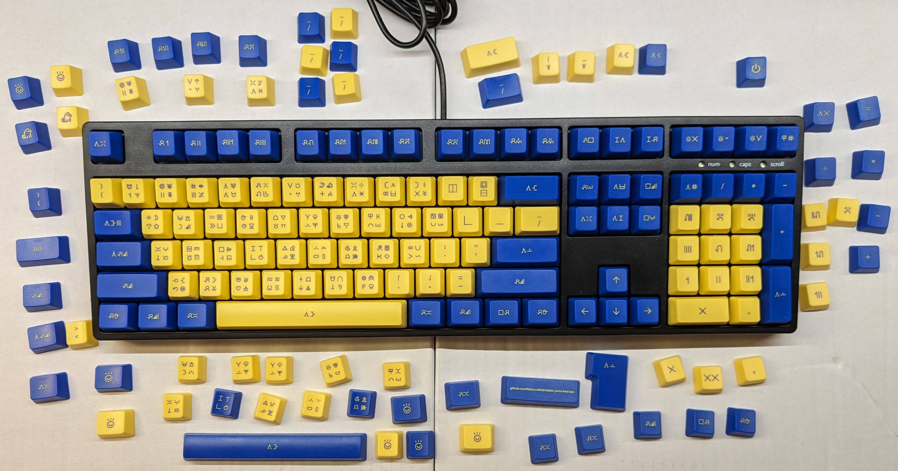
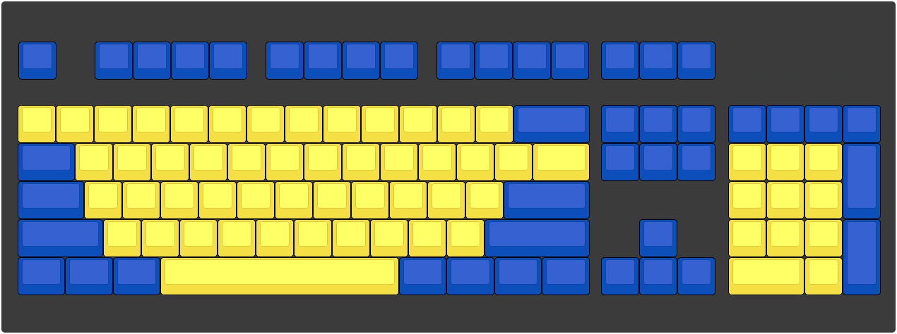
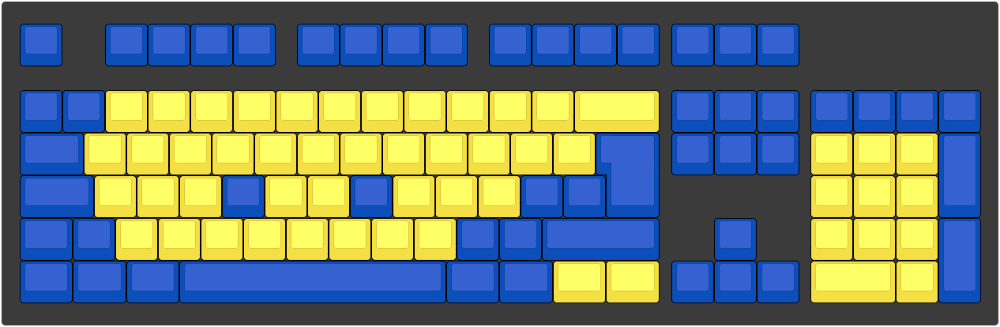

# Sitelen Pona Keycaps

Design files for keycaps based on [this keyboard layout](https://www.kreativekorp.com/software/keyboards/sitelenpona/) for sitelen pona, the logographic writing system for toki pona.

# How to Order the Base Set

The base set has all 104 keys for a standard ANSI (US) keyboard.

* Go to [this page](https://www.maxkeyboard.com/ansi-layout-custom-color-cherry-mx-keycap-set.html) (ANSI Layout Custom Color Cherry MX Keycap Set)
* Select these options:
  * Keycap Layout: ANSI 104-key (FULL SIZE)
  * Bottom Row Layout: 6.25x Unit Spacebar
  * Keycap Print Method: Top Print (keys will be top printed)
  * Wire Keycap Puller Tool: *Your choice.*
  * Artwork File Selection: I will upload my print file
  * Upload Your Artwork: *Select the file **MAX_sitelen_pona_flat.ai** from this repository.*
  * Comment: *You can leave this blank.*
* **Do not click Add to Cart yet!**
* Scroll down to the keycap set designer and click the following buttons in this order:
  * 1.Bottom Row
  * 6.25x Spacebar Row
  * 2.Keycap Color
  * Blue color swatch ("Royal Blue Keycap")
  * All Keys
  * Yellow color swatch ("Yellow Keycap")
  * Alphanumeric
* Double check that the keycap set designer looks like the picture below.
* Once you are done, click "I confirm that the layout is correct."
* **Now** scroll back up and click Add to Cart.

# How to Order the Extras

The extras include keycaps for ISO (European) keyboards, JIS (Japanese) keyboards, alternate sitelen pona glyphs, little-endian and big-endian numbers, media keys, and toki pona and kijetesantakalu logographs.

* Go to [this page](https://www.maxkeyboard.com/iso-layout-custom-color-cherry-mx-keycap-set-top-print-blank.html) (ISO Layout Custom Color Cherry MX Keycap Set (Top Print / Blank))
* Select these options:
  * Keycap Layout: ISO 88-key (TKL)
  * Bottom Row Layout: 6.25x Unit Spacebar
  * Keycap Print Method: Top Print
  * Wire Keycap Puller Tool: *Your choice. If you already ordered one for the base set, you don't need to order one here, unless you want two for some reason.*
  * Artwork File Selection: I will upload my print file
  * Upload Your Artwork: *Select the file **MAX_sitelen_pona_extras_flat.ai** from this repository.*
  * Comment: *You can leave this blank.*
* **Do not click Add to Cart yet!**
* Scroll down to the keycap set designer and click the following buttons in this order:
  * 1.Bottom Row
  * 6.25x Spacebar Row
  * 2.Keycap Color
  * Blue color swatch ("Royal Blue Keycap")
  * All Keys
  * Yellow color swatch ("Yellow Keycap")
  * Alphanumeric
* This gets you most of the way there, but you're not done yet! A few keys need their colors changed from yellow to blue or vice versa.
  * Click the blue color swatch.
  * Click the two keycaps at the far left of the number row.
  * Click the keycaps for the F and J keys.
  * Click the two keycaps to the bottom left of the enter key.
  * Click the keycap to the right of the left shift key.
  * Click the two keycaps to the left of the right shift key.
  * Click the spacebar keycap.
  * Click on the dark background of the keycap set designer to deselect any selected keycaps.
  * Click the yellow color swatch.
  * Click the backspace keycap.
  * Click the two keycaps at the far right of the modifier row.
* Double check that the keycap set designer looks like the picture below.
* Once you are done, click "I confirm that the layout is correct."
* **Now** scroll back up and click Add to Cart.

# Translation Guide

| sitelen pona                                   | sitelen Lasina    | gloss                    | English            |
| ---------------------------------------------- | ----------------- | ------------------------ | ------------------ |
|                    | pali wan          | "function one"           | F1                 |
|  | pali luka luka tu | "function five five two" | F12                |
|                  | tawa weka         | "move away"              | escape             |
|                | tawa monsi        | "move behind"            | backspace          |
|              | tawa sinpin       | "move forward"           | space              |
|    | tawa sinpin mute  | "move forward a lot"     | tab                |
|                    | kama lon          | "become exist"           | enter, return      |
|        | awen pana sewi    | "keep emit above"        | caps lock          |
|                  | pana sewi         | "emit above"             | shift              |
|                  | pali lawa         | "function control"       | control            |
|                  | pali sewi         | "function above"         | meta, win, command |
|                  | pali ante         | "function other"         | alt                |
|                  | lipu pali         | "page of functions"      | context menu       |
|                  | pana ante         | "emit other"             | altgr, option      |
|                  | pana lipu         | "emit page"              | print screen       |
|                  | pini tawa         | "stop movement"          | scroll lock        |
|                  | pini pali         | "stop work"              | pause/break        |
|                  | pana insa         | "put inside"             | insert             |
|                  | kama weka         | "become away"            | delete             |
|                  | tawa open         | "move begin"             | home               |
|                  | tawa pini         | "move end"               | end                |
|                  | lipu sewi         | "page above"             | page up            |
|                  | lipu anpa         | "page under"             | page down          |
|                | awen nanpa        | "keep numbers"           | num lock           |
|                    | kama ala          | "become nothing"         | clear              |
|                | kalama ala        | "sound nothing"          | mute               |
|              | kalama lili       | "sound small"            | volume down        |
|              | kalama suli       | "sound big"              | volume up          |
|                  | ilo nanpa         | "tool for numbers"       | calculator         |
