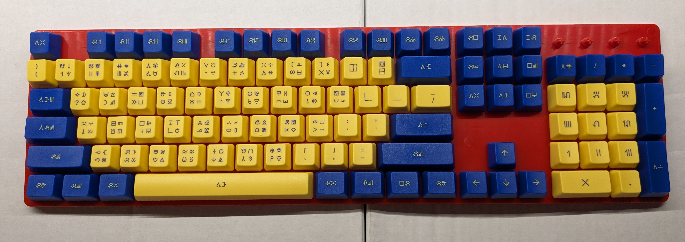

# Sitelen Pona Keycaps

Design files for keycaps based on [this keyboard layout](https://www.kreativekorp.com/software/keyboards/sitelenpona/) for sitelen pona, the logographic writing system for toki pona.

# How to Order

* Go to [this page](https://www.maxkeyboard.com/ansi-layout-custom-color-cherry-mx-keycap-set.html)
* Select these options:
  * Keycap Layout: ANSI 104-key (FULL SIZE)
  * Bottom Row Layout: 6.25x Unit Spacebar
  * Keycap Print Method: Top Print (keys will be top printed)
  * Wire Keycap Puller Tool: *Your choice.*
  * Artwork File Selection: I will upload my print file
  * Upload Your Artwork: *Select the file **MAX_sitelen_pona_flat.ai** from this repository.*
  * Comment: *You can leave this blank.*
* **Do not click Add to Cart yet!**
* Scroll down to the keycap set designer and click the following buttons in this order:
  * 1.Bottom Row
  * 6.25x Spacebar Row
  * 2.Keycap Color
  * Blue color swatch ("Royal Blue Keycap")
  * All Keys
  * Yellow color swatch ("Yellow Keycap")
  * Alphanumeric
  * I confirm that the layout is correct
* **Now** scroll back up and click Add to Cart.

